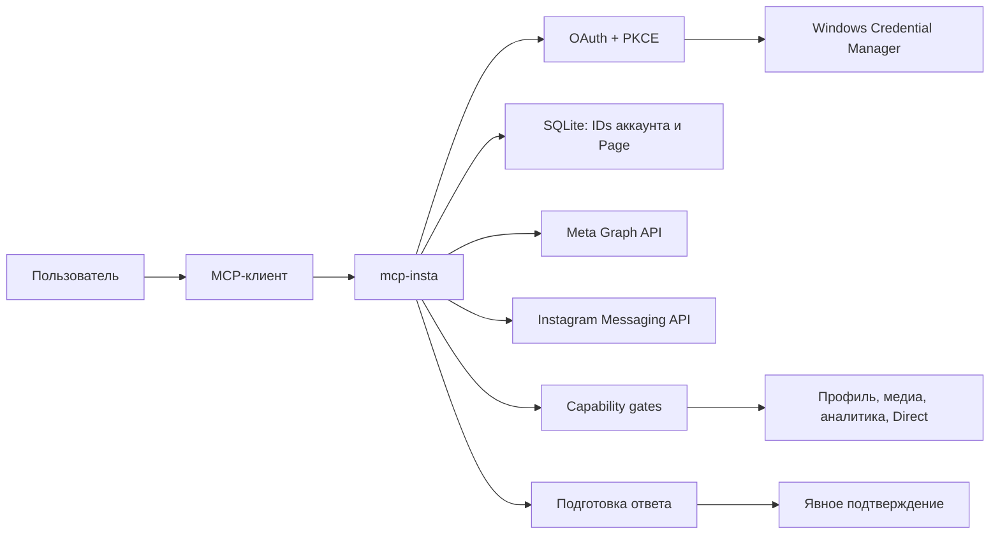

# mcp-insta

Локальный MCP-сервер для Windows, который безопасно подключает один профессиональный Instagram Creator/Business аккаунт к AI-клиенту через Meta Graph API.

Он рассчитан на работу с одной заранее выбранной связкой Facebook Page → Instagram. Секреты и access token остаются в Windows Credential Manager; SQLite хранит только техническую привязку аккаунта и Page.

## Что умеет

| Задача | MCP-инструменты | Режим |
| --- | --- | --- |
| Подключить аккаунт и проверить доступ | `insta_auth_start`, `insta_auth_complete`, `insta_auth_status`, `insta_diagnose` | OAuth с PKCE |
| Читать профиль и медиа | `ig_get_profile`, `ig_get_media_list`, `ig_get_media` | Только чтение |
| Читать аналитику | `ig_get_account_insights`, `ig_get_media_insights` | Только чтение |
| Читать Instagram Direct | `ig_get_conversations`, `ig_get_messages`, `ig_get_message` | Только чтение |
| Ответить в Direct | `ig_direct_reply_prepare` → `ig_direct_reply_confirm` | Только после явного подтверждения |
| Читать комментарии | `ig_get_comments`, `ig_get_comment`, `ig_get_replies` | Зарегистрировано, но намеренно недоступно в этой поставке |

`ig_direct_reply_prepare` создаёт одноразовую операцию и ничего не отправляет. Только отдельный вызов `ig_direct_reply_confirm` выполняет отправку. Срок действия подготовленной операции — пять минут.

## Как устроено



Расширенная схема: [docs/architecture/project-graph.mmd](docs/architecture/project-graph.mmd).

<details>
<summary>Структура проекта</summary>

```text
.
├── docs/                  # настройка Meta, Windows и матрица возможностей
├── scripts/               # сборка и подготовка пакета
├── src/
│   ├── auth/              # OAuth + PKCE и выбор Page → Instagram
│   ├── direct/            # ссылки и Direct workflow
│   ├── meta/              # Graph и Page Messaging клиенты
│   ├── secrets/           # Windows Credential Manager
│   ├── storage/           # локальная SQLite-привязка
│   └── tools/             # MCP-инструменты
└── tests/                 # unit и интеграционные проверки
```
</details>

## Быстрый старт

Нужны Windows и Node.js 22.5 или новее.

```powershell
npm ci
npm run build
```

Добавьте собранный сервер в конфигурацию MCP-клиента:

```json
{
  "mcpServers": {
    "insta": {
      "command": "node",
      "args": ["C:\\path\\to\\mcp-insta\\dist\\index.js"]
    }
  }
}
```

## Настройка Meta и подключение

1. Создайте Meta App с Facebook Login for Business.
2. Свяжите профессиональный Instagram Creator/Business аккаунт с отдельной Facebook Page.
3. Добавьте redirect URI `http://localhost:8787/callback`.
4. В Windows Credential Manager создайте generic credentials `mcp-insta/app-id` и `mcp-insta/app-secret`.
5. Вызовите `insta_auth_start`, завершите OAuth в браузере, затем вызовите `insta_auth_complete`.
6. Запустите `insta_diagnose`: он открывает каждую возможность только после успешной API-проверки именно этой связки аккаунтов.

Полная инструкция: [настройка Windows](docs/setup-windows.md), [настройка Meta](docs/meta-setup.md), [матрица возможностей](docs/compatibility-matrix.md).

## Границы безопасности

- App ID, App Secret и access token не попадают в `.env`, SQLite, логи или ответы MCP.
- Cookie и тексты Direct не сохраняются локально.
- OAuth закрепляет ровно одну выбранную связку Page → Instagram; неоднозначный результат отклоняется.
- Ошибки очищаются от токенов и параметров URL.
- Перед Graph-запросами проверяются capability gates, формат ID и совместимость метрик с endpoint.
- Подтверждение Direct-ответа — единственная исходящая операция. Публикация, отправка сообщений одним вызовом и модерация комментариев не реализованы.

## Превью


> Один Instagram-аккаунт, проверенные данные, ответ только после подтверждения.

## Проверка

```powershell
npm run check
npm pack --dry-run --json
```

Набор тестов проверяет OAuth с PKCE, привязку Page → Instagram, хранение и редактирование секретов, capability gates, MCP-протокол, безопасные ошибки, Graph read API, пагинацию, аналитику и контракт Direct `prepare → confirm`.

## Документация

- [Технический аудит](AUDIT.md)
- [Приёмка первого релиза](docs/first-release-acceptance.md)
- [Настройка Windows](docs/setup-windows.md)
- [Настройка Meta](docs/meta-setup.md)
- [Матрица совместимости](docs/compatibility-matrix.md)

## Лицензия

[MIT](LICENSE)

<details>
<summary>История версий README</summary>

- 2026-07-20 · `07b8e7d` · `docs: redesign README with verified preview` · [Открыть редакцию](https://github.com/lstunn25ai/mcp-insta/blob/07b8e7d68cb0a9e5d9e15b6779bc7cedf5d92b0f/README.md)
- 2026-07-20 · `f600005` · `feat: establish secure Instagram MCP` · [Открыть редакцию](https://github.com/lstunn25ai/mcp-insta/blob/f60000576125de21260d869fda86902b9101a5f0/README.md)
</details>
