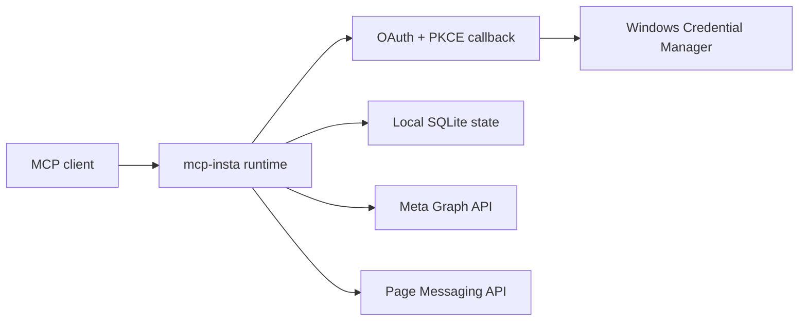

# mcp-insta

Локальный MCP-сервер для Windows, который подключает один профессиональный Instagram Creator/Business аккаунт к AI-клиенту через Meta Graph API.

Сервер хранит App ID, App Secret и access tokens только в Windows Credential Manager. В локальном SQLite остаются только идентификаторы привязанного аккаунта и Page — без токенов, cookie и текстов Direct.

## Возможности

| Область | Инструменты | Статус |
| --- | --- | --- |
| Подключение | `insta_auth_start`, `insta_auth_complete`, `insta_auth_status`, `insta_diagnose` | Поддерживается |
| Профиль и медиа | Профиль, список медиа, одно медиа | Только чтение |
| Аналитика | Инсайты аккаунта и медиа | Только чтение |
| Instagram Direct | Диалоги, сообщения и одно сообщение | Только чтение |
| Ответ в Direct | `ig_direct_reply_prepare` → `ig_direct_reply_confirm` | Требует явного подтверждения |
| Комментарии | Read-инструменты зарегистрированы | Пока недоступны |

`ig_direct_reply_prepare` ничего не отправляет. Единственная операция записи — отдельный вызов `ig_direct_reply_confirm` с одноразовым идентификатором подготовленного ответа, срок которого составляет пять минут.

## Архитектура



Расширенная схема: [docs/architecture/project-graph.mmd](docs/architecture/project-graph.mmd).

## Установка

Требуется Windows и Node.js 22.5 или новее.

```powershell
npm ci
npm run build
```

Подключите собранный сервер в конфигурации MCP-клиента:

```json
{
  "mcpServers": {
    "insta": {
      "command": "node",
      "args": ["C:\\path\\to\\mcp-insta\\dist\\index.js"]
    }
  }
}
```

## Конфигурация и OAuth

1. Создайте Meta App с Facebook Login for Business и профессиональный Instagram аккаунт, связанный с отдельной Facebook Page.
2. Добавьте redirect URI `http://localhost:8787/callback`.
3. В Windows Credential Manager создайте generic credentials `mcp-insta/app-id` и `mcp-insta/app-secret`.
4. В MCP-клиенте выполните `insta_auth_start`, завершите OAuth в браузере, затем вызовите `insta_auth_complete`.
5. Запустите `insta_diagnose`. Он открывает capability gates только после успешных проверок API.

Не помещайте токены, секреты, пароль или cookie в `.env`, конфигурацию MCP, логи или чат. `.env.example` содержит только безопасный пример версии API.

Подробности: [настройка Windows](docs/setup-windows.md), [настройка Meta](docs/meta-setup.md), [матрица возможностей](docs/compatibility-matrix.md).

## Проверки

```powershell
npm run check
npm pack --dry-run --json
```

Тесты покрывают OAuth с PKCE, привязку Page → Instagram, хранение секретов, capability gates, протокол MCP, редактирование ошибок, Graph read API, pagination и контракт Direct `prepare → confirm`.

## Tags / Keywords

`mcp` · `model-context-protocol` · `instagram` · `meta-graph-api` · `oauth2` · `typescript` · `windows`

<details>
<summary>Project Evolution</summary>

| Version | Date | Key changes |
| --- | --- | --- |
| 2.0.2 | 2026-07-19 | Подготовка независимого публичного репозитория: безопасный OAuth, read API, Direct с явным подтверждением и удаление неиспользуемого legacy-кода. |

</details>
